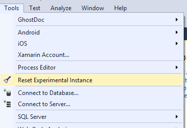
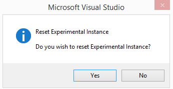
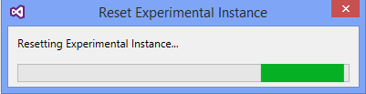

# Reset Experimental Instance

<!-- Update the VS Gallery link after you upload the VSIX-->
Download this extension from the [VS Gallery](https://visualstudiogallery.msdn.microsoft.com/[GuidFromGallery])
or get the [CI build](http://vsixgallery.com/extension/a452f910-6b6e-4ebd-952f-d8f1cd8c09b4/).

---------------------------------------

When you are developing a Visual Studio Package project or any VSIX project, by default your application will be set to start debugging in a Visual Studio Experimental instance. This is in a bid to safeguard your Visual Studio development environment from untested extensions that might change it.
Visual Studio Experimental Instance is an instance of Visual Studio that has its own registry, settings, extension. This Instance enables developers to test extensions without breaking development environment. As the VSIX package testing accumulates, there is the possibility of corrupting test environment.
This tool resets and clean the Experimental Instance, presenting you with a pristine environment you have the first time you start the Visual Studio experimental instance.

See the [changelog](CHANGELOG.md) for changes and roadmap.

## Features

- Reset and Clean Visual Studio Experimental Instance

### Reset Exp Instance
In Visual Studio's top menu under Tools, a new command is now visible:

Clicking the **Reset Experimental Instance** button will prompt you to confirm
the resetting process.

The progress of the resetting process. When it finishes, the progress form will close.

## Contribute
Check out the [contribution guidelines](CONTRIBUTING.md)
if you want to contribute to this project.

For cloning and building this project yourself, make sure
to install the
[Extensibility Tools 2015](https://visualstudiogallery.msdn.microsoft.com/ab39a092-1343-46e2-b0f1-6a3f91155aa6)
extension for Visual Studio which enables some features
used by this project.

## License
[Apache 2.0](LICENSE)